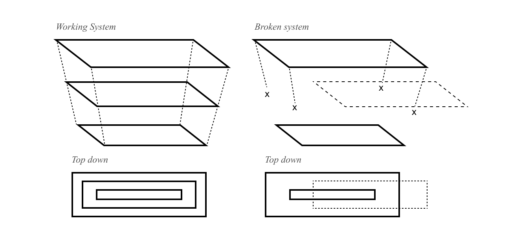

As I walked my dog through my neighborhood, I was struck by the realization that everything around me could be viewed as a system. From the simple act of putting the leash on my dog to the grid-like pattern of the sidewalks and the neatly arranged trees, each element was connected and interdependent, forming a larger, complex system. The lawns, serving as a buffer between the sidewalk and the houses, were part of a larger system of property lines and boundaries. The city we were walking in was part of a system of cities within the state, which was in turn part of a system of states within the country. This chain of systems extended outward, encompassing the world and beyond. Each of these systems was designed at some point, whether by nature or by humans. They were created to serve a purpose, to fulfill a need or to bring order to the world. In this moment, I was struck by the power of design, how it shapes our experiences and the world around us. The systems we create shape our perceptions and define our reality, and it is through this understanding that we can strive to create a better, more harmonious world.

Systems exist solving problems for the users we design for. It encompasses a wide range of factors that contribute to a positive experience for the end-user when using a product or service. System design is a crucial component of UX design, as it determines how users interact with the product or service and ultimately shapes their experience. In this essay, we will examine the impact of system design on UX and its significance in both a macro and micro level, as well as how our perceptions limit our understanding of these systems, but do not define their limits.

Starting with a macro perspective, system design in UX can be seen as a holistic approach to creating a user-centered product or service. It considers all the elements that make up the experience, including the product’s structure, functionality, and aesthetics. The goal of system design is to create a seamless, intuitive experience that makes the user feel as though they are interacting with the product or service in a natural and effortless way. This approach requires a deep understanding of the user’s needs, behaviors, and goals, and an understanding of how the product or service fits into their lives.

From a micro perspective, system design impacts UX by shaping the individual interactions that users have with the product or service. This can include things like the layout of the interface, the organization of information, and the flow of interactions. The goal of system design at this level is to create an experience that is as simple and intuitive as possible, reducing the amount of cognitive load required to use the product or service. This in turn leads to a better overall experience for the user, as they are able to accomplish their goals more efficiently and effectively.

An epistemological perspective on system design and UX highlights the limitations of our understanding of these systems. Our perceptions and experiences are shaped by our individual background, culture, and experiences. As a result, what we consider to be a “good” or “effective” system design may be limited by our own biases and perspectives. This means that there is always room for improvement and growth in the field of UX design, as new insights and perspectives can shed light on new and better ways of designing systems that meet the needs of users.

In conclusion, the impact of system design on UX cannot be overstated. It shapes the overall experience that users have with a product or service, and is critical to creating an experience that is both enjoyable and effective. While our perceptions and experiences limit our understanding of these systems, they do not define their limits. The field of UX design is constantly evolving, and there is always room for improvement and growth as we continue to learn more about what makes for an effective and user-centered experience.
